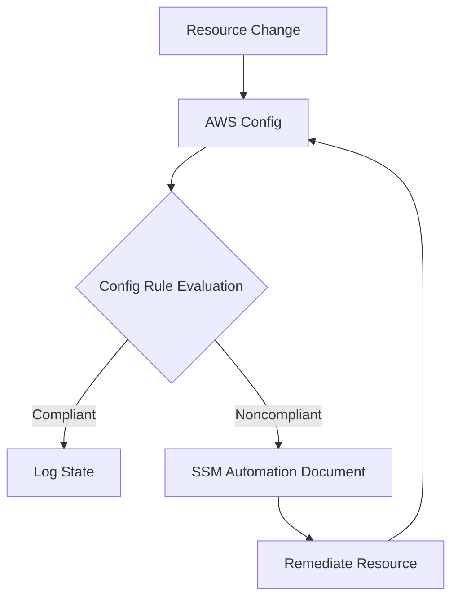
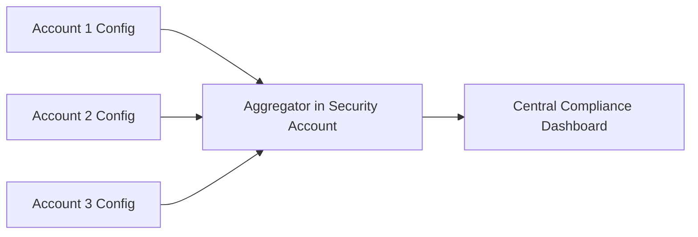

# AWS Config Overview

## Introduction
AWS Config is a service that enables you to assess, audit, and evaluate the configurations of your AWS resources. It continuously monitors and records your AWS resource configurations and allows you to automate the evaluation of recorded configurations against desired configurations. With AWS Config, you can review changes in configurations and relationships between AWS resources, dive into detailed resource configuration histories, and determine your overall compliance against the configurations specified in your internal guidelines.

## Core Concepts

### Configuration Items (CIs)
A configuration item represents a point-in-time view of the various attributes of a supported AWS resource (e.g., metadata, relationships, configuration state). AWS Config creates a CI whenever it detects a change in the resource configuration.

### AWS Config Rules
A Config rule represents your desired configuration settings for specific AWS resources. If a resource violates a rule, AWS Config flags the resource and the rule as noncompliant.
- **Managed Rules:** Pre-built rules provided by AWS (e.g., `s3-bucket-public-read-prohibited`, `encrypted-volumes`).
- **Custom Rules:** Rules you create using AWS Lambda functions (or AWS CloudFormation Guard) to evaluate resources against custom logic.

### Conformance Packs
A conformance pack is a collection of AWS Config rules and remediation actions that can be easily deployed as a single entity in an account and a region or across an organization in AWS Organizations. It helps manage compliance at scale.

### Remediations
You can associate AWS Systems Manager (SSM) Automation documents with AWS Config rules to automatically or manually remediate noncompliant resources.

### Aggregators
An aggregator is an AWS Config resource type that collects AWS Config configuration and compliance data from multiple accounts and regions into a single account (useful for multi-account oversight).

## Key Capabilities for DevOps & Architecture

1. **Continuous Monitoring & Compliance**
   Unlike CloudTrail, which logs *who* made the API call, Config records *what* the resource looked like before and after the API call. It provides an inventory and history of configurations.

2. **Automated Remediation**
   DevOps engineers use Config rules linked to SSM Automation to enforce self-healing infrastructure (e.g., automatically terminating public EC2 instances, enabling S3 encryption).

3. **Multi-Account Visibility**
   Using AWS Organizations, an administrator can deploy Config rules and conformance packs across all member accounts globally, and view the compliance status in a central Delegated Administrator account using Aggregators.

## Common Architecture Patterns

### Continuous Compliance & Auto-Remediation

### Multi-Account Aggregation

