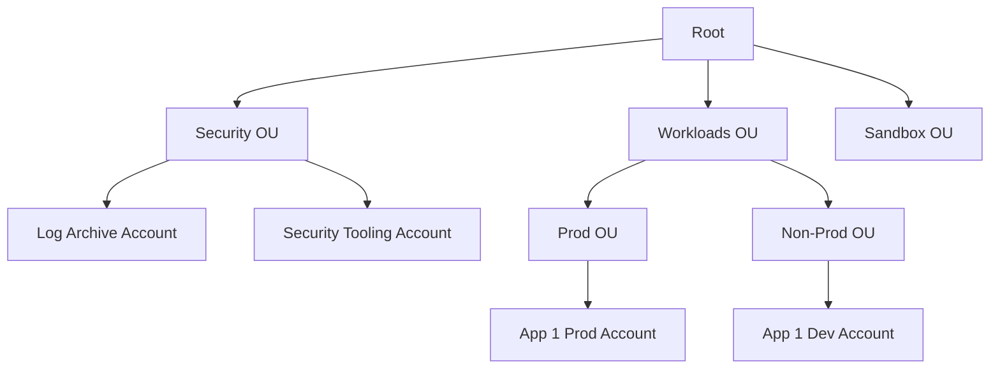

# AWS Organizations Overview

## Introduction
AWS Organizations is an account management service that enables you to consolidate multiple AWS accounts into an organization that you create and centrally manage. It provides policy-based management for multiple AWS accounts, allowing you to centrally automate account creation, govern workloads, and apply security controls. 

## Core Concepts

### Organization and Root
An organization is a collection of AWS accounts that you can organize into a hierarchy and manage centrally. The root is the parent container for all accounts and organizational units (OUs) within your organization.

### Organizational Units (OUs)
An OU is a logical container for accounts within a root. An OU can also contain other OUs, enabling you to create a hierarchy that resembles your company's structure or workload isolation strategy (e.g., separating Prod from Non-Prod).

### Service Control Policies (SCPs)
SCPs are JSON policies that specify the maximum available permissions for an organization, OU, or account. They do not grant permissions; instead, they define boundary limits (guardrails) on what actions IAM users and roles in member accounts can perform.

### Consolidated Billing
This feature allows you to see a combined view of charges incurred by all accounts in the organization, and it allows you to take advantage of pricing benefits from aggregated usage (e.g., volume discounts for S3 storage or EC2 data transfer).

## Key Capabilities for DevOps & Architecture

1. **Account Vending & Automation**
   Using AWS Organizations with AWS CloudFormation StackSets, DevOps teams can automatically provision new accounts with baseline configurations (VPCs, IAM roles, security tools) upon creation.

2. **Centralized Security Guardrails**
   Applying SCPs at the OU level allows centralized security teams to enforce compliance. For example, an SCP can prevent any account in a "Production" OU from deleting VPC Flow Logs or disabling CloudTrail.

3. **Delegated Administration**
   You can register a member account as a delegated administrator for supported AWS services (e.g., AWS Config, GuardDuty, Macie). This separates security duties from the Management Account, adhering to least privilege.

## Common Architecture Patterns

### Multi-Account Strategy with OUs

