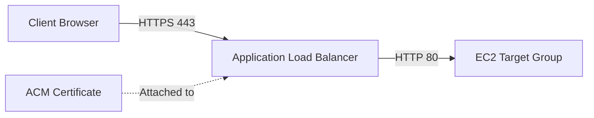

# AWS Certificate Manager (ACM) Overview

## Introduction
AWS Certificate Manager (ACM) is a service that lets you easily provision, manage, and deploy public and private Secure Sockets Layer/Transport Layer Security (SSL/TLS) certificates for use with AWS services and your internal connected resources. SSL/TLS certificates are used to secure network communications and establish the identity of websites over the Internet as well as resources on private networks.

## Core Concepts

### Public Certificates
ACM can provision public SSL/TLS certificates that are trusted by web browsers. These are provided at no additional cost. ACM manages the renewal of these certificates automatically.

### Private Certificates (ACM PCA)
AWS Private Certificate Authority (PCA) allows you to create private certificate authorities without the upfront investment and maintenance costs of operating your own PKI infrastructure. Private certificates are used to secure internal communication between microservices, containers, or on-premises servers.

### Validation Methods
To obtain a public certificate, you must prove that you control the domain. ACM supports two methods:
- **DNS Validation:** Requires adding a specific CNAME record to your DNS configuration (recommended).
- **Email Validation:** Sends an email to the domain registrant with an approval link.

## Key Capabilities for DevOps & Architecture

1. **Automated Renewals**
   When using DNS validation, ACM attempts to automatically renew public certificates 60 days before they expire. If the CNAME record is still in place, the renewal is completely hands-off.

2. **Native AWS Integrations**
   ACM certificates cannot be downloaded directly (for public certs). Instead, they are natively integrated with services like Application Load Balancers (ALB), API Gateway, and Amazon CloudFront. The private key never leaves the AWS KMS infrastructure.

3. **Multi-Region Considerations**
   ACM certificates are regional resources. If you have an ALB in `eu-west-1` and another in `us-east-1`, you must provision identical certificates in both regions. The exception is Amazon CloudFront, which requires the ACM certificate to be in the `us-east-1` (N. Virginia) region regardless of where the edge locations are.

## Common Architecture Patterns

### Public Facing Web Application

