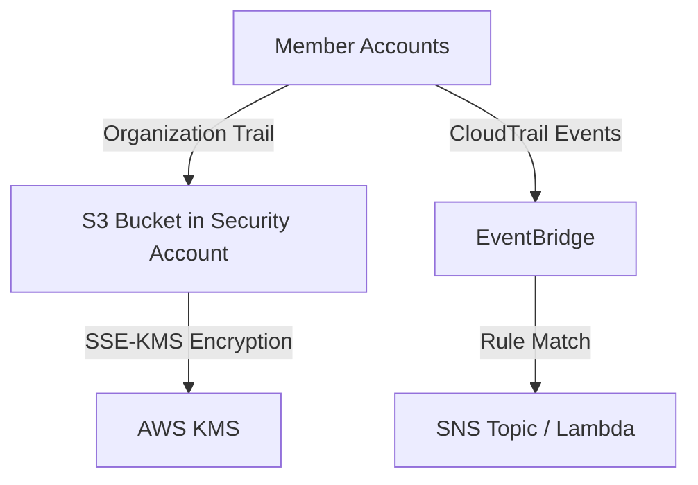
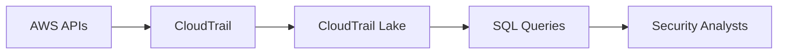

# AWS CloudTrail Overview

## Introduction
AWS CloudTrail is a foundational security and governance service that enables compliance, operational auditing, and risk auditing of your AWS account. With CloudTrail, you can log, continuously monitor, and retain account activity related to actions across your AWS infrastructure. CloudTrail provides event history of your AWS account activity, including actions taken through the AWS Management Console, AWS SDKs, command line tools, and other AWS services.

## Core Concepts

### Management Events
Management events (also known as "control plane operations") provide visibility into management operations that are performed on resources in your AWS account. These include:
- Creating/deleting a VPC (`CreateVpc`, `DeleteVpc`)
- Attaching IAM policies (`AttachRolePolicy`)
- Creating EC2 instances (`RunInstances`)

By default, trails log management events. You can separate Read and Write management events.

### Data Events
Data events (also known as "data plane operations") provide visibility into the resource operations performed on or within a resource. These are high-volume activities:
- S3 object-level APIs (`GetObject`, `PutObject`, `DeleteObject`)
- Lambda function executions (`Invoke`)
- DynamoDB item-level APIs (`PutItem`, `DeleteItem`, `UpdateItem`)

Data events are disabled by default due to their high volume and associated costs.

### Insights Events
CloudTrail Insights helps AWS users identify and respond to unusual activity associated with API calls and API error rates by continuously analyzing CloudTrail management events. When an anomalous pattern is detected, CloudTrail generates an Insights event.

### CloudTrail Lake
CloudTrail Lake is a managed data lake that lets you aggregate, immutably store, and query your events. It replaces the need to build a custom data lake using Amazon S3 and Amazon Athena, allowing for SQL-based querying natively within CloudTrail.

## Key Capabilities for DevOps & Architecture

1. **Log File Integrity Validation**
   To determine whether a log file was modified, deleted, or unchanged after CloudTrail delivered it, you can use CloudTrail log file integrity validation. This feature is built using industry standard algorithms: SHA-256 for hashing and SHA-256 with RSA for digital signing.

2. **Organization Trails**
   For multi-account architectures, DevOps engineers must implement an organization trail. This automatically logs all events for all AWS accounts in the AWS Organization to a centralized S3 bucket in the management or delegated administrator account. Individual member accounts cannot modify or delete the organization trail.

3. **KMS Encryption (SSE-KMS)**
   By default, CloudTrail encrypts logs using S3 server-side encryption with S3-managed encryption keys (SSE-S3). For enhanced security and auditing of access to the logs, configure CloudTrail to use SSE-KMS with a customer managed key (CMK).

4. **EventBridge Integration**
   CloudTrail seamlessly integrates with Amazon EventBridge, allowing you to trigger automated remediation workflows, Lambda functions, or SNS notifications based on specific API activities.

## Common Architecture Patterns

### Centralized Logging and Alerting

### Forensic Analysis with CloudTrail Lake

