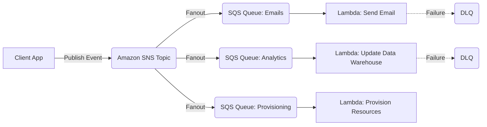
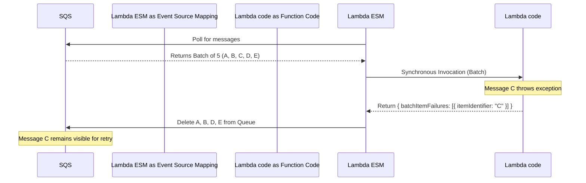
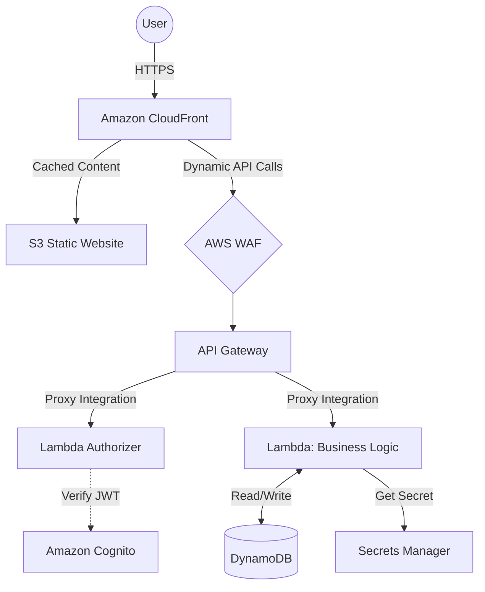
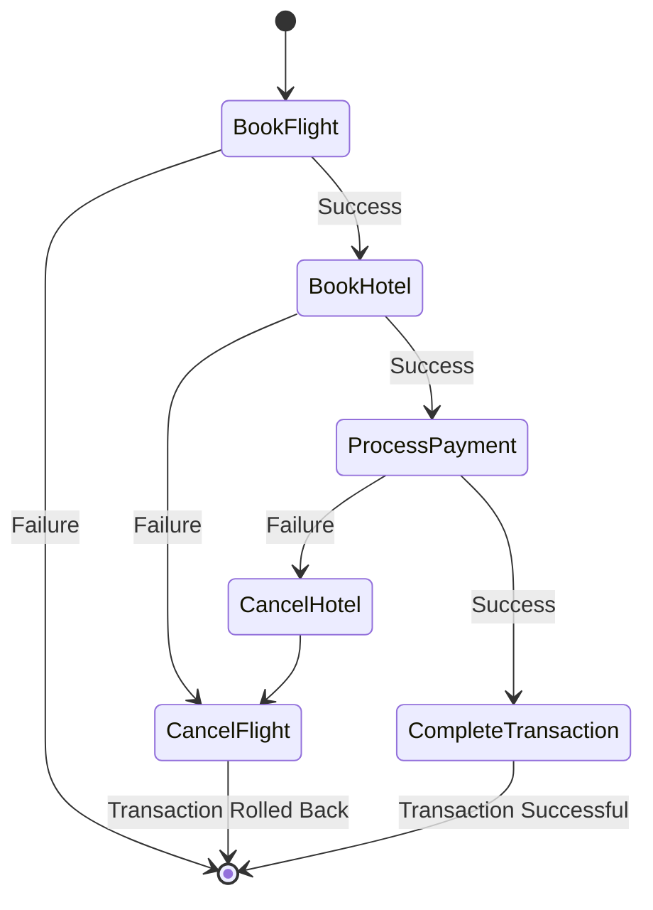

# AWS Lambda - Architecture Diagrams

These Mermaid diagrams illustrate common serverless patterns and concepts.

### 1. The Fanout Pattern

This pattern allows asynchronous parallel processing of a single event.

### 2. SQS Batch Processing with Partial Failures

Illustrating how Lambda handles batches and returns partial failures.

### 3. API Gateway Serverless Backend

A highly scalable synchronous web application backend.

### 4. Step Functions Saga Pattern

Handling distributed transactions and rollbacks.

