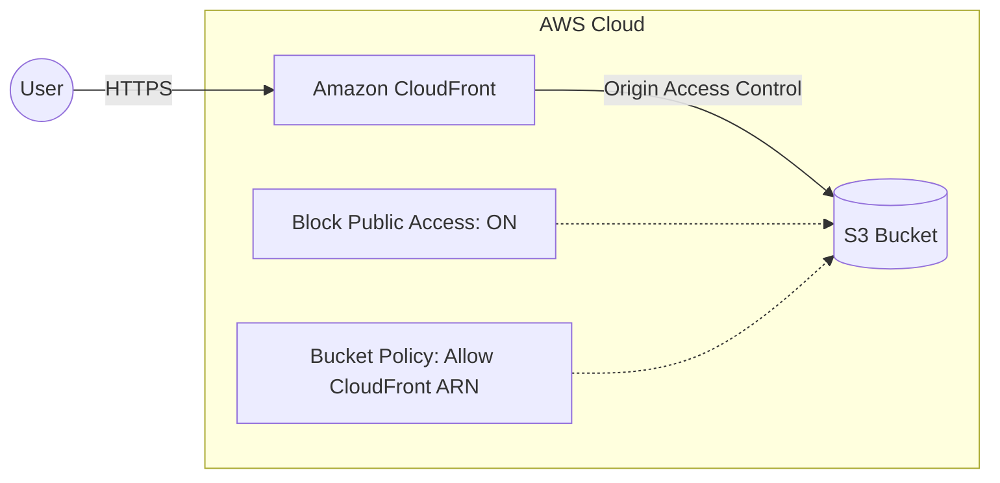
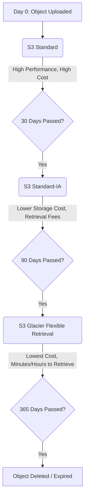
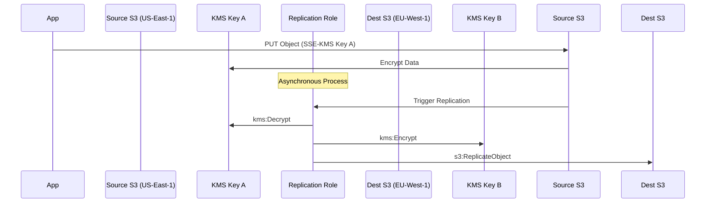
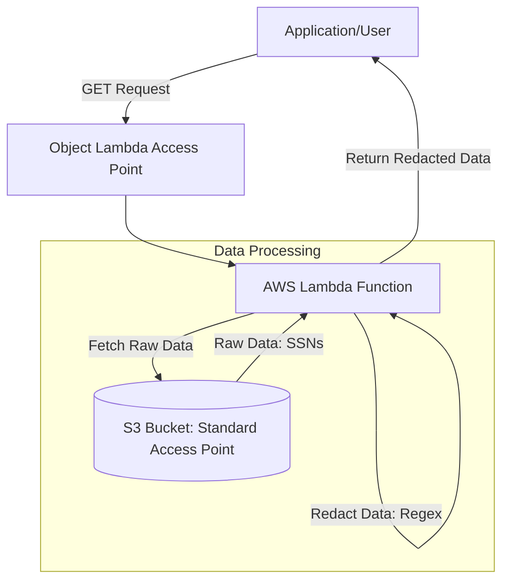

# Amazon S3 - Architecture Diagrams

These Mermaid diagrams illustrate common storage patterns and concepts.

### 1. Secure Static Website Architecture

Using CloudFront and OAC to securely serve content from a private S3 bucket.

### 2. S3 Lifecycle Data Tiering

Automating cost optimization over time.

### 3. S3 Cross-Region Replication with KMS

Illustrating the IAM permissions required to replicate KMS-encrypted objects.

### 4. S3 Object Lambda Dynamic Redaction

Intercepting GET requests to manipulate data on the fly.

